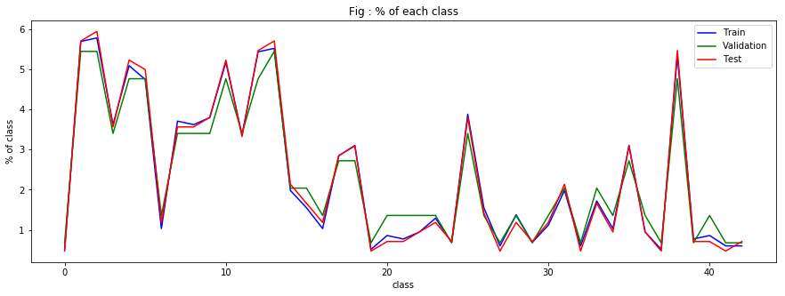
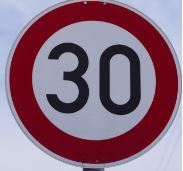
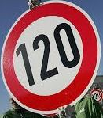
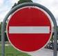
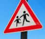
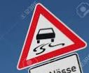
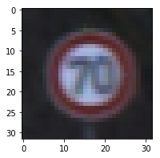
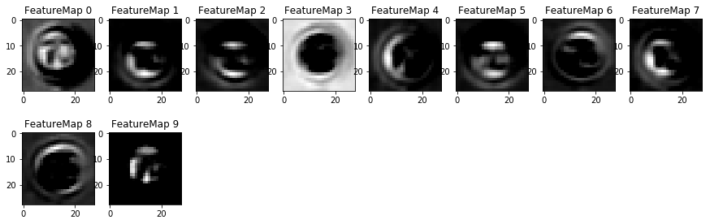
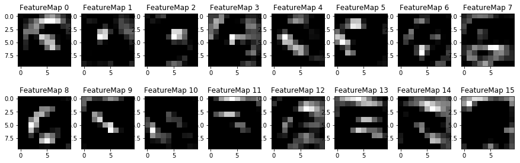

# **Term1-Project 2 : Traffic Sign Recognition** 

---

**Build a Traffic Sign Recognition Project**

The goals / steps of this project are the following:
* Load the data set (see below for links to the project data set)
* Explore, summarize and visualize the data set
* Design, train and test a model architecture
* Use the model to make predictions on new images
* Analyze the softmax probabilities of the new images
* Summarize the results with a written report

## Rubric Points
### Here I will consider the [rubric points](https://review.udacity.com/#!/rubrics/481/view) individually and describe how I addressed each point in my implementation.  

---
### Writeup / README

#### 1. Provide a Writeup / README that includes all the rubric points and how you addressed each one. You can submit your writeup as markdown or pdf. You can use this template as a guide for writing the report. The submission includes the project code.

You're reading it! and here is a link to my [project code](./Traffic_Sign_Classifier.ipynb)

### Data Set Summary & Exploration

#### 1. Provide a basic summary of the data set. In the code, the analysis should be done using python, numpy and/or pandas methods rather than hardcoding results manually.

I used the numpy library to calculate summary statistics of the traffic
signs data set:

* The size of training set is 34799
* The size of the validation set is 4410
* The size of test set is 12630
* The shape of a traffic sign image is (32, 32, 3)
* The number of unique classes/labels in the data set is 43

#### 2. Include an exploratory visualization of the dataset.

Here is an exploratory visualization of the data set. 
It is a line chart showing percentage of each class in train,validation and test dataset.



### Design and Test a Model Architecture

#### 1. Describe how you preprocessed the image data. What techniques were chosen and why did you choose these techniques? Consider including images showing the output of each preprocessing technique. Pre-processing refers to techniques such as converting to grayscale, normalization, etc. (OPTIONAL: As described in the "Stand Out Suggestions" part of the rubric, if you generated additional data for training, describe why you decided to generate additional data, how you generated the data, and provide example images of the additional data. Then describe the characteristics of the augmented training set like number of images in the set, number of images for each class, etc.)


I just did normalization for preprocessing because I think other pre-processing is just like a kind of feature engineering. In my opinion , preprocessing is not an essential technique except normalization.

#### 2. Describe what your final model architecture looks like including model type, layers, layer sizes, connectivity, etc.) Consider including a diagram and/or table describing the final model.

My final model consisted of the following layers:

| Layer         		|     Description	        					| 
|:---------------------:|:---------------------------------------------:| 
| Input          		| 32x32x3 RGB image   							| 
| Convolution      	| 5x5x3, 1x1 stride, same padding, outputs 28x28x10 	|
| ReLU					|												|
| pooling	      	| k=2 , 2x2 stride,  outputs 14x14x10 				|
| Convolution 	    | 5x5x10, 1x1 stride, same padding, outputs 10x10x16|
| ReLU					|												|
| pooling	      	| k=2 , 2x2 stride,  outputs 5x5x16 				|
| Fully connected		| Input = 400. Output = 120        									|
| Fully connected		| Input = 120. Output = 84        									|
| Fully connected		| Input = 84. Output = 43        									|

#### 3. Describe how you trained your model. The discussion can include the type of optimizer, the batch size, number of epochs and any hyperparameters such as learning rate.

To train the model, I modified basic LeNet architecture and tweaked learning rate,epoch and batch size.

* Increaseed depth of input convolution layer 6 to 10.
* learning rate = 0.005
* BATCH_SIZE = 256
* EPOCHS = 50

**NOTE : ** _Epoch was the most importance factor in my training model._

#### 4. Describe the approach taken for finding a solution and getting the validation set accuracy to be at least 0.93. Include in the discussion the results on the training, validation and test sets and where in the code these were calculated. Your approach may have been an iterative process, in which case, outline the steps you took to get to the final solution and why you chose those steps. Perhaps your solution involved an already well known implementation or architecture. In this case, discuss why you think the architecture is suitable for the current problem.

My final model results were:
* training set accuracy of 0.998
* validation set accuracy of 0.936 
* test set accuracy of 0.931

If a well known architecture was chosen:
* What architecture was chosen? 
  : LeNet applied to MNIST
* Why did you believe it would be relevant to the traffic sign application?
  : I thoght classification of MNIST dataset and traffic sign is very simlilar.
    So, I had a confidence that LeNet architecture wil show accuaray more than 0.9
* How does the final model's accuracy on the training, validation and test set provide evidence that the model is working well?
 : After training model , it showed pretty good performance on trainig and vailiation dataset.
   I've finally tested it on test dataset which is never used during training process and got a accuracy 0.93.
   This means my model is working well on new data.

### Test a Model on New Images

####1. Choose five German traffic signs found on the web and provide them in the report. For each image, discuss what quality or qualities might be difficult to classify.

Here are six German traffic signs that I found on the web:







The **second, fouth, fifth image** might be difficult to classify because they were somewhat rotated.

#### 2. Discuss the model's predictions on these new traffic signs and compare the results to predicting on the test set. At a minimum, discuss what the predictions were, the accuracy on these new predictions, and compare the accuracy to the accuracy on the test set (OPTIONAL: Discuss the results in more detail as described in the "Stand Out Suggestions" part of the rubric).

Here are the results of the prediction:

| Image			        |     Prediction	        					| 
|:---------------------:|:---------------------------------------------:|
| 30 km/h	      		| 30 km/h					 				|
| 120 km/h	      		| No vehicles					 				|
| No entry    			| No entry 										|
| Children Crossing					| No passing											|
| Slippery Road			| No passing for vehicles over 3.5 metric tons      							|
| Stop Sign      		| Stop sign   									| 

The model was able to correctly guess 6 of the 3 traffic signs, which gives an accuracy of 50%. 
This is very low compared to training accuracy.
The reason is
* When I resized the image to 32x32 , It was even difficult for me to classify them.(especially fifth image)
  I thought if I increase input layer more than 32x32 , accuracy will go higher.
* Failed image were all somewhat rotated. I guess in my training set there weren't much rotated image.
  This will be improved if I train model with more rotated images.

#### 3. Describe how certain the model is when predicting on each of the five new images by looking at the softmax probabilities for each prediction. Provide the top 5 softmax probabilities for each image along with the sign type of each probability. (OPTIONAL: as described in the "Stand Out Suggestions" part of the rubric, visualizations can also be provided such as bar charts)

The code for making predictions on my final model is located in the 28th cell of the Ipython notebook.

For the first image, the model is relatively sure that this is a 30km/h speed limit sign (probability of 1.0), and the image does contain a 30km/h speed limit sign. The top five soft max probabilities were

| Probability         	|     Prediction	        					| 
|:---------------------:|:---------------------------------------------:| 
| 1.0         			| Speed limit (30km/h)   									| 
| 0     				| Speed limit (20km/h) 										|
| 0					| Speed limit (50km/h)											|
| 0	      			| Speed limit (60km/h)					 				|
| 0				    | Speed limit (70km/h)      							|

For the second image the model is relatively sure that this is a No vehicles sign (probability of 1.0), and the image does contain a no entry sign. The top five soft max probabilities were

| Probability         	|     Prediction	        					| 
|:---------------------:|:---------------------------------------------:| 
| 1.0         			| No vehicles   								| 
| 7.03564404e-14     				| Roundabout mandatory				|
| 1.42534168e-31					| Speed limit (50km/h)				|
| 1.66132102e-32	      			| End of no passing	 				|
| 1.03108920e-32				    | Keep right  						|

For the third image the model is relatively sure that this is a No entry sign (probability of 1.0), and the image does contain a no entry sign. The top five soft max probabilities were

| Probability         	|     Prediction	        					| 
|:---------------------:|:---------------------------------------------:| 
| 1.0         			| no entry   									| 
| 0     				| Speed limit (20km/h) 										|
| 0					| Speed limit (50km/h)											|
| 0	      			| Speed limit (60km/h)					 				|
| 0				    | Speed limit (70km/h)      							|

For the fouth image the model is relatively sure that this is a No passing sign (probability of 0.99), and the image does contain a Children crossing sign. The top five soft max probabilities were

| Probability         	|     Prediction	        					| 
|:---------------------:|:---------------------------------------------:| 
| 9.99389410e-01         			| No passing   									| 
| 7.03564404e-14     				| Bicycles crossing										|
| 1.42534168e-31					| Go straight or right											|
| 1.66132102e-32	      			| Keep right				 				|
| 1.03108920e-32				    | Slippery road   |

For the fifth image the model is relatively sure that this is a No passing sign (probability of 0.99), and the image does contain a Slippery road sign. The top five soft max probabilities were

| Probability         	|     Prediction	        					| 
|:---------------------:|:---------------------------------------------:| 
| 9.99389410e-01         			| No passing   									| 
| 5.95806169e-28    				|Road work									|
| 1.96850534e-34					| Speed limit (120km/h)											|
| 0      			| Speed limit (20km/h)				 				|
| 0				    | Speed limit (30km/h)   |

For the sixth image the model is relatively sure that this is a Stop sign (probability of 1.0), and the image does contain a Stop sign. The top five soft max probabilities were

| Probability         	|     Prediction	        					| 
|:---------------------:|:---------------------------------------------:| 
| 1.0         			| Stop   									| 
| 0     				| Speed limit (20km/h) 										|
| 0					| Speed limit (50km/h)											|
| 0	      			| Speed limit (60km/h)					 				|
| 0				    | Speed limit (70km/h)      							|


### (Optional) Visualizing the Neural Network (See Step 4 of the Ipython notebook for more details)


#### Original Image


#### Convolution Layer 1 feature maps


#### Convolution Layer 2 feature maps


#### 1. Discuss the visual output of your trained network's feature maps. What characteristics did the neural network use to make classifications?

* Automatic gray transform :  Convolution Layer 1 feature maps shows that this CNN is interested in shape and gradient of image.
It looks like color is not so important. I can say CNN does gray transform from color image so there is no great reason to preprocess 'gray transforming'.

* Disappearing circle shape in Convolution Layer 2 feature maps : In Convolution Layer 1 feature maps , I am able to see some circle shape related result but in layer 2 result It's hard to say network detecting circle shape.

* Effect of overlaying feature maps : This is my later To-Do. It just occurred to me that overlaying some features maps together mabe be hepful.

* It's not easy for me to describe how CNN classifing traffic signs using on layer 2 features at this moemnt.
I need to give further thought about this with time and more exprerience about CNN


```python

```
