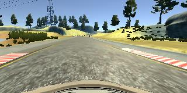
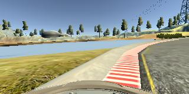
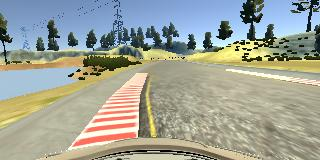
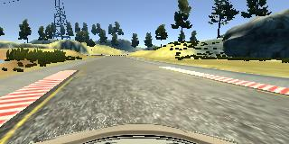
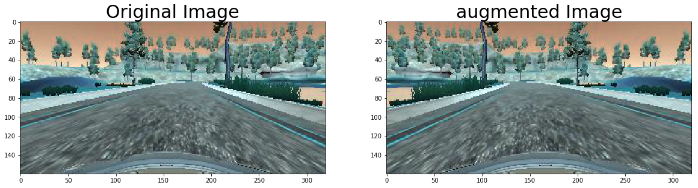
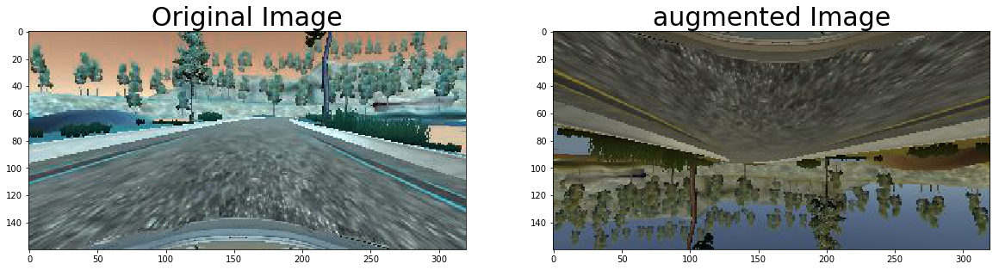
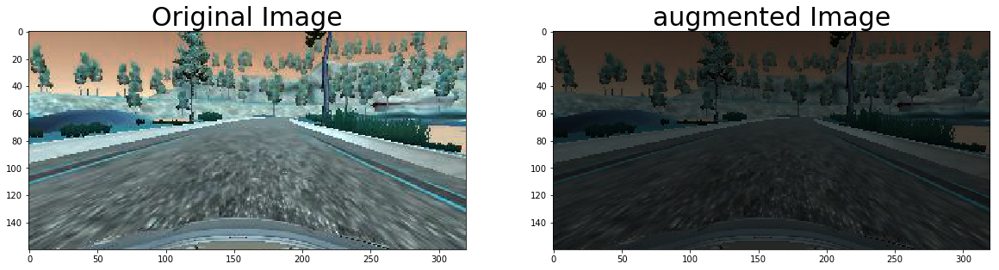

# **Behavioral Cloning**

## Writeup
---

** Behavioral Cloning Project **

The goals / steps of this project are the following:
* Use the simulator to collect data of good driving behavior
* Build, a convolution neural network in Keras that predicts steering angles from images
* Train and validate the model with a training and validation set
* Test that the model successfully drives around track one without leaving the road
* Summarize the results with a written report


[//]: # (Image References)

[image1]: ./examples/placeholder.png "Model Visualization"
[image2]: ./examples/placeholder.png "Grayscaling"
[image3]: ./examples/placeholder_small.png "Recovery Image"
[image4]: ./examples/placeholder_small.png "Recovery Image"
[image5]: ./examples/placeholder_small.png "Recovery Image"
[image6]: ./examples/placeholder_small.png "Normal Image"
[image7]: ./examples/placeholder_small.png "Flipped Image"

## Rubric Points
### Here I will consider the [rubric points](https://review.udacity.com/#!/rubrics/432/view) individually and describe how I addressed each point in my implementation.  

---
### Files Submitted & Code Quality

#### 1. Submission includes all required files and can be used to run the simulator in autonomous mode

My project includes the following files:
* model.py containing the script to create and train the model
* drive.py for driving the car in autonomous mode
* model.h5 containing a trained convolution neural network
* writeup_report.md or writeup_report.pdf summarizing the results

#### 2. Submission includes functional code
Using the Udacity provided simulator and my drive.py file, the car can be driven autonomously around the track by executing
```sh
python drive.py model.h5
```

#### 3. Submission code is usable and readable

The `model.py` file contains the code for training and saving the convolution neural network.
The file `batch_generate.py` contains the code for augmenting images and generate batches.

### Model Architecture and Training Strategy

#### 1. An appropriate model architecture has been employed

My model consists of a convolution neural network with 5x5 and 3x3 filter sizes and depths between 24 and 64 (`model.py` lines 37-58)

The model includes RELU layers to introduce nonlinearity , and the data is normalized in the model using a Keras lambda layer (code line 38).

#### 2. Attempts to reduce overfitting in the model

The model contains dropout layers in order to reduce overfitting (`model.py` lines 52-58).

The model was trained and validated on augmented data sets to ensure that the model was not overfitting (code line 10-16). The model was tested by running it through the simulator and ensuring that the vehicle could stay on the track.

#### 3. Model parameter tuning

The model used an adam optimizer, the learning rate was fixed as `lr = 0.0001` (model.py line 76).

#### 4. Appropriate training data

* Basic training data were collected manually by hand using mouse.
  one loop of normal drive , one loop of reverse drive.
* I used only a center lane driving, adding some recovering data where the car fails.

For details about how I created the training data, see the next section.

### Model Architecture and Training Strategy

#### 1. Solution Design Approach

The overall strategy for deriving a model architecture was to use NVIDIA Autopilot model for starting point and training network with augmented data.

At first,I started with a small convoution and fully connected layers to minimize network parameters.
The result was not so good and so I added more layers and increased convolution layer depth.
But it also didn't worked well. I thought key point is in the data than complex network architecture.
I decided to use NVIDIA Autopilot model for starting point and applied image augmentation on origianl image to get bunch of data.

In order to gauge how well the model was working, I split my image and steering angle data into a training and validation set. The ratio was 8:2. I found that my first model had the same mean squared error on the training set and the validation set. This implied that the model was relatively well trained or underfitted.
So, I reduced dropout rate in fully connected layers from 0.5 to 0.2 and it gives increse of accuracy on both training and vailidation set.

The final step was to run the simulator to see how well the car was driving around track one. There were a few spots where the vehicle fell off the track... to improve the driving behavior in these cases, I added recovery data at that spots

At the end of the process, the vehicle is able to drive autonomously around the track without leaving the road.

#### 2. Final Model Architecture

The final model architecture (model.py lines 37-58)


|Layer (type)                     |Output Shape          |Param #     |Connected to                 |    
|---------------------------------------------------------------------------------------------------|
|lambda_1 (Lambda)                |(None, 160, 320, 3)   |0           |lambda_input_1[0][0]            |
|convolution2d_1 (Convolution2D)  |(None, 78, 158, 24)   |1824       | lambda_1[0][0]                  |
|convolution2d_2 (Convolution2D)  |(None, 37, 77, 36)    |21636      | convolution2d_1[0][0]     |       
|convolution2d_3 (Convolution2D)  |(None, 17, 37, 48)    |43248       |convolution2d_2[0][0]      |      
|convolution2d_4 (Convolution2D)  |(None, 15, 35, 64)    |27712       |convolution2d_3[0][0]      |      
|convolution2d_5 (Convolution2D)  |(None, 13, 33, 64)    |36928       |convolution2d_4[0][0]      |      
|flatten_1 (Flatten)              |(None, 27456)         |0           |convolution2d_5[0][0]      |      
|dense_1 (Dense)                  |(None, 1164)          |31959948    |flatten_1[0][0]            |      
|dropout_1 (Dropout)              |(None, 1164)          |0           |dense_1[0][0]              |      
|dense_2 (Dense)                  |(None, 100)           |116500      |dropout_1[0][0]            |      
|dropout_2 (Dropout)              |(None, 100)           |0           |dense_2[0][0]              |      
|dense_3 (Dense)                  |(None, 50)            |5050        |dropout_2[0][0]            |      
|dropout_3 (Dropout)              |(None, 50)            |0           |dense_3[0][0]              |      
|dense_4 (Dense)                  |(None, 10)            |510         |dropout_3[0][0]            |      
|dense_5 (Dense)                  |(None, 1)             |11          |dense_4[0][0]              |      


#### 3. Creation of the Training Set & Training Process

To capture good driving behavior, I first recorded one laps on track one using center lane driving. Here is an example image of center lane driving:



I then recorded the vehicle recovering from the left side and right sides of the road back to center so that the vehicle would learn to go to the center lane when it is off centered. These images show what a recovery looks like starting from left lane egde to center lane:







Then I repeated this process on track two in order to get more data points.

To augment the data sat,
flipped images and angles thinking that this would increase dataset. Here are images that has then been applied:

* Random Flip Vertical


* Random Flip Horizontal


* Random Cropping


* Random Brightness


After the collection process, I had 4000 number of data points. I then preprocessed this data by random augmenting at each batches, so I got 4000 * 2^3 data points without brightness augmenting.
If include random brightness augmentaion , there are huge amount of data points.

I finally randomly shuffled the data set and put 20% of the data into a validation set.

I used this training data for training the model. The validation set helped determine if the model was over or under fitting. I had trained about 30 epochs using CPU. I think error would be reduced if I train more epoch. I used an adam optimizer with fixed learning rate 0.0001 without manually tunning it.
