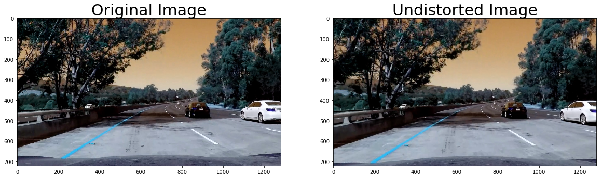
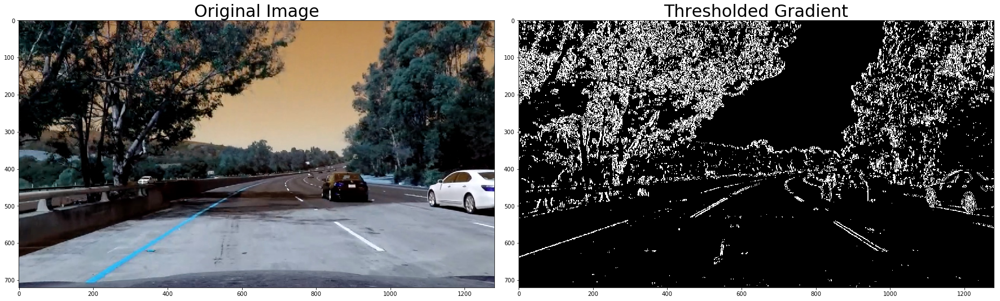
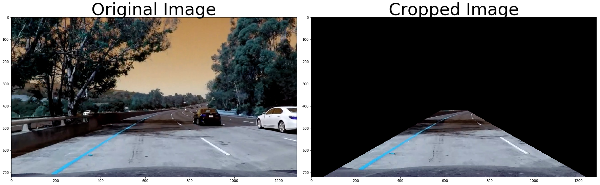
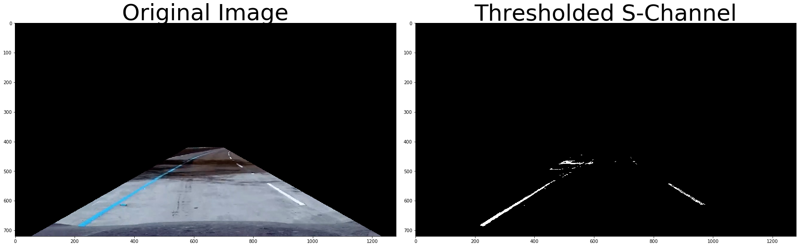
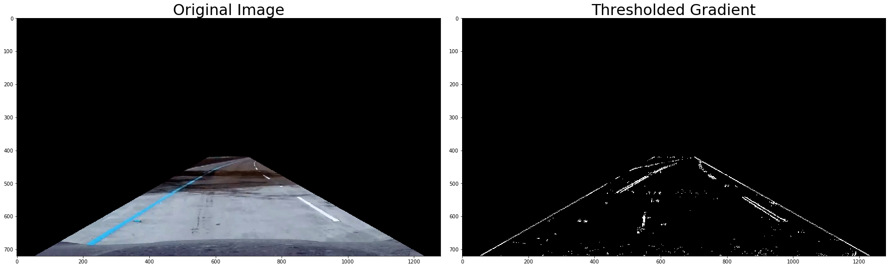
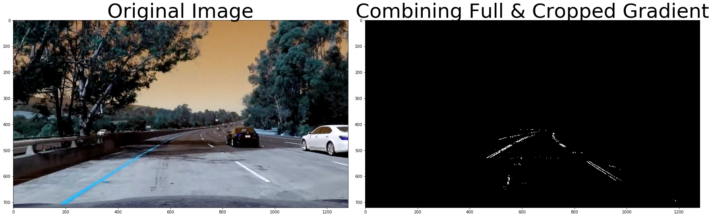
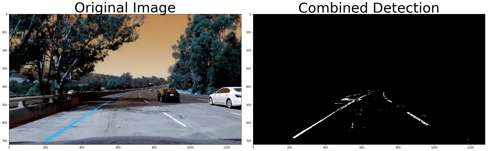
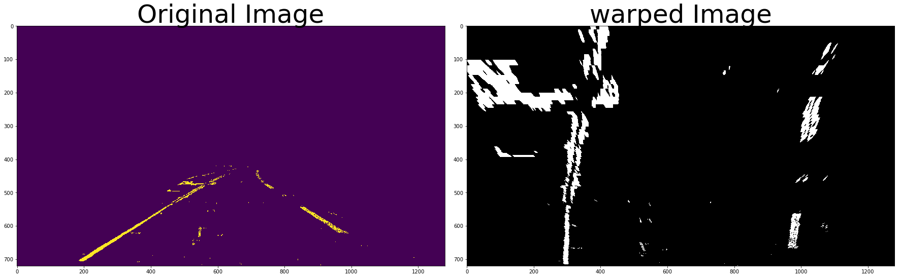
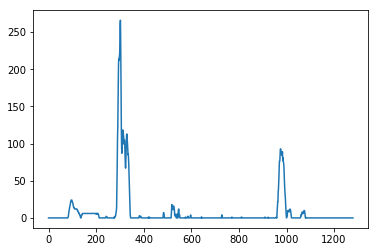
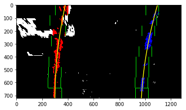

## Writeup - Advanced Lane Finding Project
---

**Advanced Lane Finding Project**

The goals / steps of this project are the following:

* Compute the camera calibration matrix and distortion coefficients given a set of chessboard images.
* Apply a distortion correction to raw images.
* Use color transforms, gradients, etc., to create a thresholded binary image.
* Apply a perspective transform to rectify binary image ("birds-eye view").
* Detect lane pixels and fit to find the lane boundary.
* Determine the curvature of the lane and vehicle position with respect to center.
* Warp the detected lane boundaries back onto the original image.
* Output visual display of the lane boundaries and numerical estimation of lane curvature and vehicle position.

## [Rubric](https://review.udacity.com/#!/rubrics/571/view) Points

### Here I will consider the rubric points individually and describe how I addressed each point in my implementation.  

---

### Writeup / README

#### 1. Project files
 * Project write-up : this file
 * Code : Jupyter Notebook (Advanced_Lane_Finding-submit.ipynb )
 * example output images : Advanced_Lane_Finding-submit.ipynb & output_images folder
 * Output video : Advanced_Lane_Finding-submit.ipynb & output_images folder

### Camera Calibration

#### 1. Briefly state how you computed the camera matrix and distortion coefficients. Provide an example of a distortion corrected calibration image.

The code for this step is contained in the `In[2]` code cell of the IPython notebook located in "Advanced_Lane_Finding-submit.ipynb"

I start by preparing "object points", which will be the (x, y, z) coordinates of the chessboard corners in the world. Here I am assuming the chessboard is fixed on the (x, y) plane at z=0, such that the object points are the same for each calibration image.  Thus, `objp` is just a replicated array of coordinates, and `objpoints` will be appended with a copy of it every time I successfully detect all chessboard corners in a test image.  `imgpoints` will be appended with the (x, y) pixel position of each of the corners in the image plane with each successful chessboard detection.  

I then used the output `objpoints` and `imgpoints` to compute the camera calibration and distortion coefficients using the `cv2.calibrateCamera()` function.  I applied this distortion correction to the test image using the `cv2.undistort()` function and obtained this result:


### Pipeline (single images)

#### 1. Provide an example of a distortion-corrected image.

To demonstrate this step, I will describe how I apply the distortion correction to one of the test images like this one:
* Load camera calibration data : mtx , distortion
* Use ```undist_img = cv2.undistort(img, mtx, dist, None, mtx)```

Here is result image



#### 2. Describe how (and identify where in your code) you used color transforms, gradients or other methods to create a thresholded binary image.  Provide an example of a binary image result.

I used combination of HLS and gradient thresholds to generate a binary image (thresholding steps at lines `In[32]` through `In[38]` in `Advanced_Lane_Finding-submit.ipynb`).

Here is step by step explanation.

### Gradient Transform on Full Image

 _Note : Gradient transform detects lane line very well but there are also a lot of unncessary data.
To remove these unncessary data, I used gradient transform on Cropped Image and gradient transform on full image combined. This will be showed following cells._




### Cropping Image in Interested Region
_This method can be applied generally if we can measure the slop of road using sensors.(i.g. Gyro or gravity sensor are already in your smart phone)_




### HLS Transform and Extract Thresholed S-Channel
_I applied max-min normalization on S-Channel. This will make treshold value more robust against variations in images._

```python
## max-min normaliztion
   normalized = (out_channel-np.min(out_channel))/(np.max(out_channel) - np.min(out_channel))
```




### Gradient on Cropped Image
_Owing to cropping, there is much of good lane data but your can see two noisy straight line in the left and right. This noise will be removed in the following cell._



### Combining Full & Cropped Gradient
_Two noisy straight line in the left and right are removed. AND operation applied._



### Combining Full & Cropped Gradient & S-Channel
_Add S-Channel information. I am able to extract good lane line data. OR operation applied._



#### 3. Describe how (and identify where in your code) you performed a perspective transform and provide an example of a transformed image.

The code for my perspective transform includes a function called `perspective_transform()`, which appears in `In[39]` code cell of the IPython notebook).  The `perspective_transform()` function takes as inputs an image (`img`).
I chose the hardcode the source and destination points in the following manner:

```python
src = np.float32([ [585,460],[203,720],[1127,720],[ 695, 460] ])
dst = np.float32([ [350, 0],[320, 720],[960, 720],[ 930, 0] ])
```

I verified that my perspective transform was working as expected by drawing the `src` and `dst` points onto a test image and its warped counterpart to verify that the lines appear parallel in the warped image.



#### 4. Describe how (and identify where in your code) you identified lane-line pixels and fit their positions with a polynomial?
* Applied sliding window to identify lane-line pixels and fit their positions with a 2nd order polynomial.
* In the previous picture , You can see there are not enough data in left line top region to predict poynomial. But right line have good data in top region. So I copied and shifted them to left region and used for left line fitting.

### Find sliding window starting point using histogram


### Fit left , right lane line using sliding windows
Enhanced sliding window searching time by using previous fit data if exist.
If there isn't previous fit data , basic sliding window search have the responsibility.





#### 5. Describe how (and identify where in your code) you calculated the radius of curvature of the lane and the position of the vehicle with respect to center.

I did this in lines `In[49]` in my Ipython Notebook.

```python
def get_road_data(left_fit,right_fit,binary_warped)
```

#### 6. Provide an example image of your result plotted back down onto the road such that the lane area is identified clearly.

I implemented this step in lines `In[51]` in my Ipython Notebook in the function `pipeline_lane_finding(image)`.  
Here is an example of my result on a test image:


---

### Pipeline (video)

#### 1. Provide a link to your final video output.  Your pipeline should perform reasonably well on the entire project video (wobbly lines are ok but no catastrophic failures that would cause the car to drive off the road!).

Here's a [link to my video result](https://youtu.be/ddqdFb532qU)

---

### Discussion

#### 1. Briefly discuss any problems / issues you faced in your implementation of this project.  Where will your pipeline likely fail?  What could you do to make it more robust?

I've realized following things.
* My model has some problem in curve. I need to tweak threshold of gradient , color space and
  structure of binary lane extraction.

* Feature extraction approach on vision data seems like vulnerable to variation.

  I want to deal this problem again with using deep learning later.

* My pipeline seems to have difficulty in variation of light , rain or snow or scenery.

 I've tried it challenge video but I can't get good results.

* I think cropping image in interested region is very useful if this combined with sensor fusion.

 Measuring slop of road using gyro sensor and gravity sensor those are already in our smart phone.
