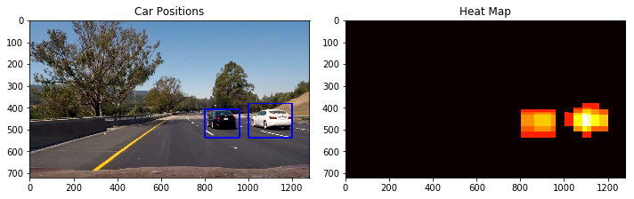

# Project : **Vehicle Detection**
### Self-Driving Car Engineer Nanodegree
---
 

---

## Overview

### 1. Objective
  * Detect cars in image and video stream
    

### 2. Applied Techniques
* Histogram of Oriented Gradients (HOG) to extract feature from training image
* Support Vector Machine(SVM) for car vs. non-car classifier
* Sliding window
* Heat-map for noise reduction

### 3. The goals / steps of this project
* Perform a Histogram of Oriented Gradients (HOG) feature extraction on a labeled training set of images and train a classifier Linear SVM classifier
* Optionally, you can also apply a color transform and append binned color features, as well as histograms of color, to your HOG feature vector.
* Note: for those first two steps don't forget to normalize your features and randomize a selection for training and testing.
* Implement a sliding-window technique and use your trained classifier to search for vehicles in images.
* Run your pipeline on a video stream (start with the test_video.mp4 and later implement on full project_video.mp4) and create a heat map of recurring detections frame by frame to reject outliers and follow detected vehicles.
* Estimate a bounding box for vehicles detected.

### 4. Result

#### Result Video
[VIDEO : Lane Line Finding](https://youtu.be/IV4Y6BVdiNw) 

---

## Reflection

### 1.Discussion
I need to make smoother output heatmap result  and adjust heatmap threshold. But I didn't cause I realized this kind of approad is not a general solution. Althogh I made excellent tunning on project video, this don't guaratee it will give good result on other video. But doing this project , I've realized the power of machine learning approach. At first I tried to enhance detection ability by tunning color_histogram, HOG , spatial bin parameters.But I couln't get good result. But after I added fail case , performance was gradually enhanced. I think using CNN , RNN will give more general and robust solution because they don't need feature extraction.

### 2.Improvements
* I am interested in applying deep learning method. I know many people already have tried DL approach.

---

## More Detailed Step-by-Step write-up is [here](https://github.com/ksjgh/SDCND/blob/master/Term1_Computer_Vision_and_Deep_Learning/05_Project-Vehicle_Detection_and_Tracking/writeup_submit_vehicle_detection.md) 

---

## Code Impementation is [here](https://github.com/ksjgh/SDCND/blob/master/Term1_Computer_Vision_and_Deep_Learning/05_Project-Vehicle_Detection_and_Tracking/Project%20-%20Vehicle%20Detection%20and%20Tracking_Submit.ipynb)
