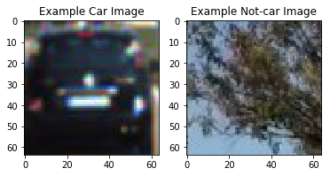
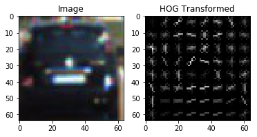
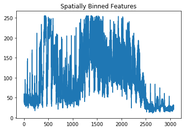
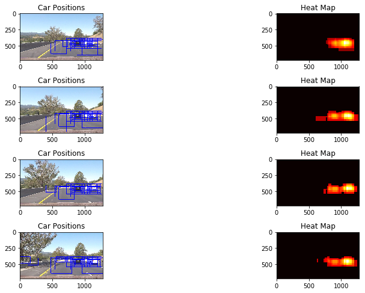

## Writeup - Project Vehicle Detection
---

**Vehicle Detection Project**

The goals / steps of this project are the following:

* Perform a Histogram of Oriented Gradients (HOG) feature extraction on a labeled training set of images and train a classifier Linear SVM classifier
* Optionally, you can also apply a color transform and append binned color features, as well as histograms of color, to your HOG feature vector.
* Note: for those first two steps don't forget to normalize your features and randomize a selection for training and testing.
* Implement a sliding-window technique and use your trained classifier to search for vehicles in images.
* Run your pipeline on a video stream (start with the test_video.mp4 and later implement on full project_video.mp4) and create a heat map of recurring detections frame by frame to reject outliers and follow detected vehicles.
* Estimate a bounding box for vehicles detected.

## [Rubric](https://review.udacity.com/#!/rubrics/513/view) Points
### Here I will consider the rubric points individually and describe how I addressed each point in my implementation.  

---
### Writeup / README

#### 1. Provide a Writeup / README that includes all the rubric points and how you addressed each one.  You can submit your writeup as markdown or pdf.

You're reading it!

### Histogram of Oriented Gradients (HOG)

#### 1. Explain how (and identify where in your code) you extracted HOG features from the training images.

The code for this step is contained in `In [5]` cell of the IPython notebook (`Project - Vehicle Detection and Tracking_Submit.ipynb`).

I started by reading in all the `vehicle` and `non-vehicle` images.  Here is an example of one of each of the `vehicle` and `non-vehicle` classes:

I then explored different color spaces and different `skimage.hog()` parameters (`orientations`, `pixels_per_cell`, and `cells_per_block`).  I grabbed random images from car classes and displayed them to get a feel for what the `skimage.hog()` output looks like.

Here is an example using the `YUV` color space and HOG parameters of `hog_channel=0` ,`orientations=9`, `pixels_per_cell=(8, 8)` and `cells_per_block=(2, 2)`:

#### 2. Explain how you settled on your final choice of HOG parameters.

I decided my HOG parameters based on the result of classifier training result.
I tried various combinations of parameters and looked which combination gives good taining result with minimum HOG features. Because mininum feautures means low processing time.
The result is
 `hog_channel=0` in `YUV` color space ( I extracted HOG feature in `Y` channel)
 `orientations=9`,
 `pixels_per_cell=(8, 8)`
 `cells_per_block=(2, 2)`:

#### 3. Describe how (and identify where in your code) you trained a classifier using your selected HOG features (and color features if you used them).

I trained a linear SVM using below features extracted from Y-channel of `YUV` color space. code is `In[9]~In[10]` cells.

- Color Histogram

- HOG

- Spatial binning : resize to (32,32)

- And each feature was concatetenated and normalized using  `sklearn.preprocessing.StandardScaler()`

- Training result is 
Feature vector length: 4736 
Test Accuracy of SVC =  0.988

### Sliding Window Search

#### 1. Describe how (and identify where in your code) you implemented a sliding window search.  How did you decide what scales to search and how much to overlap windows?

- I used four search region as decribed below. code is `In[11] ~ In[15]` cells.
- At bottom of image , window size is large because car image is large in this region.
- At middle of image , window size is small because car image is small in this region.

1-1. Searching Window 1 
'y_start_stop':[400 ,700 ],
          'window_size':(320 ,240),
          'window_overlap':(0.75 , 0.75)}

1-2. Searching Window 2 
'y_start_stop':[380 ,620],
              'window_size':(240,160),
              'window_overlap':( 0.75 , 0.75)}

1-3. Searching Window 3 
'y_start_stop':[380 ,536],
               'window_size':(160,104),
               'window_overlap':( 0.75 , 0.75)}

1-4. Searching Window 4 
'y_start_stop':[380 ,540],
              'window_size':(80,87),
              'window_overlap':( 0.75 , 0.5)}

1-5. Searching Window total 
'Total number of windows = 289

#### 2. Show some examples of test images to demonstrate how your pipeline is working.  What did you do to optimize the performance of your classifier?

Ultimately I searched on using `Y` 1-channel HOG features plus spatially binned color and histograms of color in the feature vector, which provided a nice result.  Here are sliding widow searching images:

---

### Video Implementation

####1. Provide a link to your final video output.  Your pipeline should perform reasonably well on the entire project video (somewhat wobbly or unstable bounding boxes are ok as long as you are identifying the vehicles most of the time with minimal false positives.)
Here's a [link to my video result](https://youtu.be/IV4Y6BVdiNw)

#### 2. Describe how (and identify where in your code) you implemented some kind of filter for false positives and some method for combining overlapping bounding boxes.

I recorded the positions of positive detections in each frame of the video.  From the positive detections I created a heatmap and then thresholded that map to identify vehicle positions.  I then used `scipy.ndimage.measurements.label()` to identify individual blobs in the heatmap.  I then assumed each blob corresponded to a vehicle.  I constructed bounding boxes to cover the area of each blob detected.  

Here's an example result showing the heatmap from a series of frames of video, the result of `scipy.ndimage.measurements.label()` and the bounding boxes then overlaid on the last frame of video:

Finally I drew box on cars averaging previous six frames of detecting results to remove false positive.

### Here are four frames and their corresponding heatmaps:

### Here the resulting bounding boxes are drawn onto the last frame in the series:

---

###Discussion

####1. Briefly discuss any problems / issues you faced in your implementation of this project.  Where will your pipeline likely fail?  What could you do to make it more robust?

I need to make smoother output heatmap result  and adjust heatmap threshold. But I didn't cause I realized this kind of approad is not a general solution. Althogh I made excellent tunning on project video, this don't guaratee it will give robust result. But doing this project , I've realized the power of machine learning approach. At first I tried to enhance detection ability by tunning color_histogram, HOG , spatial bin parameters.But I couln't get good result. But after I added fail case , performance was gradually enhanced. I think using CNN , RNN will give more general and robust solution because they don't need feature extraction.
