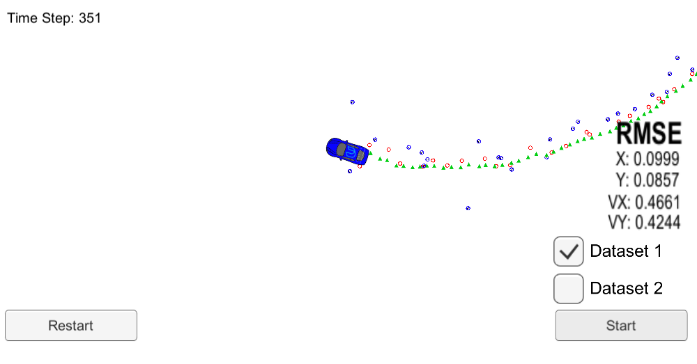

# Project : **Extended Kalman Filter**
---

## Estimate vehicle's position(state) using EKF
 Red dots : Noisy LiDAR data , input to EKF 
 Blue dots : Noisy Radar data , input to EKF 
 Green triangles : Estimated position , output of EKF

#### Result Video Link - [Extended Kalman Filter](https://youtu.be/AxB2kRkKnU4) 
---

## Overview

### 1. Goals
  * Utilize EKF(extended kalman filter) to estimate the state of a moving object with noisy lidar and radar measurements. 
  * Obtain low RMSE(Root Mean Square Error) values. 

  *Note : 
  The simulator provide program  
  1) Noisy Rada sensor data. 
  2) Noisy LiDAR sensor data.* 

  *Program estimate 
  1) current position : x, y 
  2) current velocity : vx, vy 
  3) RSME of x, y, vx, vy* 

### 2. Applied Techniques
* Linearization of Radar sensor data for kalman fiter
* Sensor data coordinate transform
* C++ , Eigen Library(for vector, matrix manipulation)

### 3. Result
* RSME of x ,  y < 0.1[m]  
* RSME of vx, vy < 0.5[m/s]
