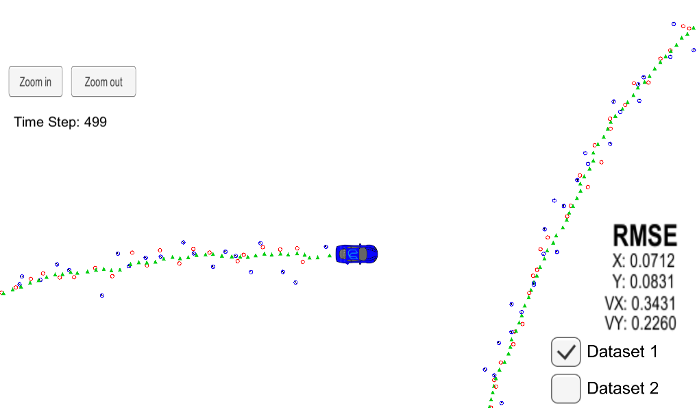

# Project : **Unscented Kalman Filter**
### Self-Driving Car Engineer Nanodegree
---

#### Result Video Link  [Unscented Kalman Filter](https://youtu.be/Rwtg0_52t1c) 

 Red dots : Noisy LiDAR data , input to UKF 
 Blue dots : Noisy Radar data , input to UKF 
 Green dots : Estimated position , output of UKF 

---

## Overview

### 1. Goals
  * Utilize UKF(Unscented kalman filter) to estimate the state of a moving object with noisy lidar and radar measurements. 
  * Obtain low RMSE(Root Mean Square Error) values. 

  *Note : 
  The simulator provide program  
  1) Noisy Rada sensor data. 
  2) Noisy LiDAR sensor data.* 

  *Program estimate 
  1) current position : x, y 
  2) current velocity : vx, vy 
  3) RSME of x, y, vx, vy* 

### 2. Applied Techniques
* Motion Models : constant turn rate and velocity magnitude model (CTRV) of car is used
* Unscented Transformation & Extended Kalman Filter
* C++ , Eigen Library(for vector, matrix manipulation)

### 3. Result
* Improved compared to using EKF
* RSME of x ,  y < 0.09[m]  
* RSME of vx, vy < 0.4[m/s]

_Note: EKF Result  
RSME of x ,  y < 0.1[m]  
RSME of vx, vy < 0.5[m/s]_
