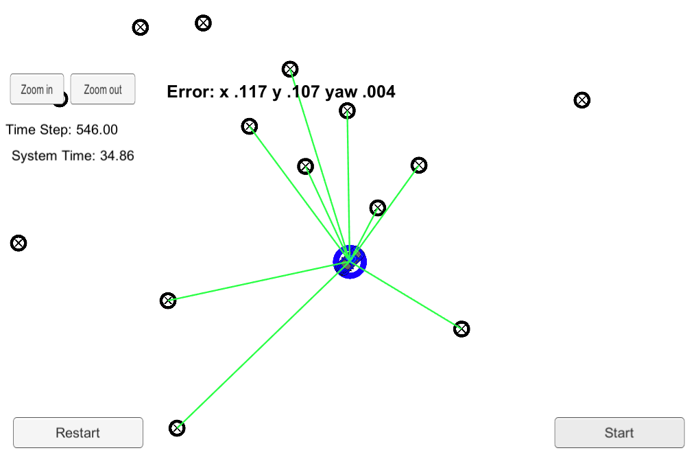

# Project : **Particle Filter**
---

#### Result Video Link - [Particle Filter](https://youtu.be/mXSa4lwoU3Q) 

 Black Circles : Landmarks in the given map , input to particle filter 
 Green line : show detected landmarks by particle 
 Blue Circle : Estimated position of vehicle by particle filter , output 

---

## Overview

### 1. Goals
  * Utilize particle filter to localize a moving object from blind start. 
  * Obtain low RMSE(Root Mean Square Error) of vehicle position(x,y) and heading direction(yaw). 

  _Note : 
  The simulator provide program  
  1) Initial GPS measurement. 
  2) Observed distance to each landmarks. 
  3) Vehicle control data_ 

  _Program compute 
  1) current position : x, y 
  2) current direction : yaw 
  3) RSME of x, y, yaw_ 

### 2. Applied Techniques
* Motion Models : constant turn rate and velocity magnitude model (CTRV) of vehicle is used for motion update process.
* Multi-variable gaussian to evaluate each particle.
* Implemented using C++

### 3. Result
* RSME of x ,  y < 0.12[m]  
* RSME of yaw < 0.04[rad]
