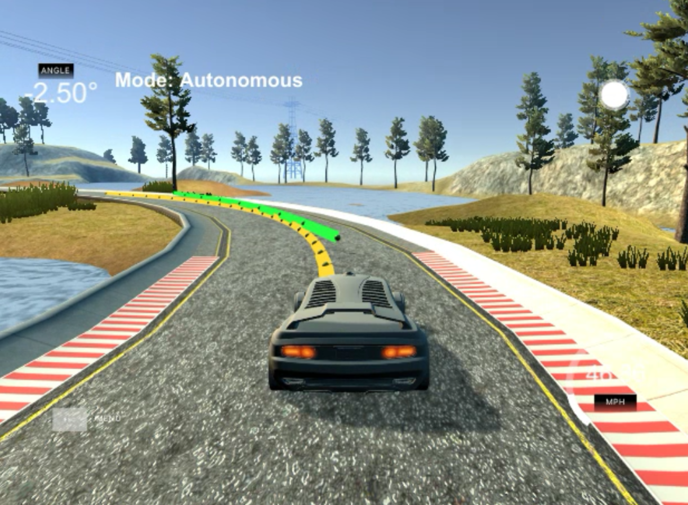

# Project : **MPC(Model Predictive Control)**
---

<br>


## Follow reference trajectory() using MPC(Model Predictive Control)

 Yellow line : Reference trajectory to follow , input to MPC<br>
 Green line : Calculated trajectory including constrains<br>

#### Result Video - [ MPC(Model Predictive control) of the car](https://youtu.be/giFZAdzGf6o)<br>
---

### 0. Overview<br>

#### 1. Goals
  * Keep the car in the center of the track using MPC<br>

  _Note : The simulator provide program<br>
  px : x-position<br>
  py : y-position<br>
  psi : steering angle<br>
  v : velocity<br>_

  _Program compute the actuator's<br>
  delta : steering angle<br>
  a : acceleration or deceleration<br>_

#### 2. Applied Techniques
* C++ , Ipopt & CppAD library
* Building a Kinematic Model
* Time-step Length and Elapsed Duration (N & dt) Tuning
* Cost function define and Weight Parameters Tuning
* Model Predictive Control with Latency

#### 3. The steps of this project
* Define state & actuator variables
* Get state variables from simulator
* Choose Time-step Length and Elapsed Duration (N & dt)
* Define Cost function and Weight Parameters
* Fit polynomials of reference trajectory from simulator
* Compute actuator control using Model Predictive Control with Latency
---

### 1.Model Description
#### 1) state variables
* px : x-position<br>
* py : y-position<br>
* psi : steering angle<br>
* v : velocity<br>
* cte : cross track error from reference trajectory <br>
* epsi : error of psi with tangential of reference trajectory<br>

#### 2) actuators
* delta : steering angle<br>
* a : acceleration or deceleration<br>


#### 3) state variables update equations


### 2. Timestep Length and Elapsed Duration (N & dt) , Cost function Weight Parameters
#### 1) How to choose N & dt
* choosed dt within control-latency(100ms) <dt< 500ms

  If dt < control-latency(100ms) then we get state before previous control has effects on car.<br>
  If dt = control-latency(100ms), it may cause some unstability. It's better to select dt slightly larger than  control-latency(100ms).<br>
  If dt > 500ms , empirically hard to accept.


* choosed N within  10 < N < 20 <br>
After deciding dt , choosed N as small as possible and N*dt < 2.0s because I thought 2.0s is reasonably maximum time to be event horizon.

#### 2) N & dt tunning
Here are the some results of drivings with a combination of N and dt.
As predicted , dt < 0.1s gives bad results.

| **N**  | **dt**   | **N\*dt** | **Avg. Speed** | **Max. Speed** | **Avg. Cost** | **Max. Cost** | **Stability** |
| ------ | -------- | --------- | -------------- | -------------- | ------------- | ------------- | ------------- |
| **10** | **0.05** | **0.5**   | Error          | Error          | Error         | Error         |               |
| **20** | **0.05** | **1**     | 65.9909        | 91.1604        | 56271.9       | 334385        | Bumpy         |
| **10** | **0.1**  | **1**     | 53.5873        | 86.8707        | 39385.5       | 121445        | Good     |
| **20** | **0.1**  | **2**     | 57.0003        | 89.3753        | 69109.7       | 240943        | Good     |
| **10** | **0.15** | **1.5**   | 44.4905        | 81.8023        | 49686.1       | 121084        | Good     |
| **10** | **0.2**  | **2**     | 37.466         | 76.0912        | 60343.5       | 119854        | Good     |

#### 3) Cost function Weight Parameters Tunning.
When calculating cost, I assigned weight to each term.
For example
```
for (size_t i = 0; i < N; i++) {
  fg[0] += 4000*CppAD::pow(vars[cte_start + i] - ref_cte, 2);
  fg[0] += 4000*CppAD::pow(vars[epsi_start + i] - ref_epsi, 2);
  fg[0] += 1.3*CppAD::pow(vars[v_start + i] - ref_v, 2);
}
```
fg[0] is cost and `4000, 4000, 1.3` is weight of each term respectively.

I defined weights like below and tweaked them.
* If you increase `W_V` , Ave. velocity increases , stability decreases.
* If you increase `W_DA`, Ave. velocity decreases , stability increases.

```
#define W_CTE 4000    // weight of 'cte' in cost
#define W_EPSI 4000   // weight of 'epsi' in cost
#define W_V 1.3       // weight of 'v' in cost
#define W_DELTA 5000  // weight of 'delta' in cost
#define W_A 5000      // weight of 'a' in cost
#define W_DDELTA 200  // weight of 'change rate of delta' in cost
#define W_DA 10       // weight of 'change rate of a' in cost
const double ref_cte = 0;   // target 'cte'
const double ref_epsi = 0;  // target 'epsi'
const double ref_v = 100;   // target 'velocity'

```

### 3.Polynomial Fitting

#### 1) convert waypoints to car's coordinate
global waypoints are converted to cars local points by below code.
```
for (size_t i = 0; i < ptsx.size(); i++) {
  double shift_x = ptsx[i]-px;
  double shift_y = ptsy[i]-py;

  ptsx[i] = (shift_x *cos(0-psi)-shift_y*sin(0-psi));
  ptsy[i] = (shift_x *sin(0-psi)+shift_y*cos(0-psi));
}
```
* ptsx : waypoint's global x-position
* ptsy : waypoint's global y-position
* px : car's global x-position
* py : car's global y-position
* psi : car' steering angle

#### 2) fitting the polynomial
car's local waypoints are used to fit 3-order polynomial by below code.
```
// fit ref. trajectory points to 3-order polynomial
auto coeffs = polyfit(ptsx_transform, ptsy_transform, 3);
```

### 4.Model Predictive Control with Latency
Estimated state is calculated including latency and fed into the mpc solver.

```
// estimate delayed state by control latency(LATENCY = 100ms)
double delay = LATENCY/1000.0; // convert to seconds
double px_delayed = v * delay;
double py_delayed = 0.0;
double psi_delayed = - v * steer_value * delay / Lf;
double v_delayed = v + throttle_value * delay;
double cte_delayed = cte + v * sin(epsi) * delay;
double epsi_delayed = epsi + psi_delayed;

Eigen::VectorXd delayed_state(6);
delayed_state << px_delayed, py_delayed, psi_delayed,
                 v_delayed, cte_delayed, epsi_delayed;
```


---

### 5.Further Improvements
* I think N&dt should be changed dynamically related to velocity and enviroment complexity.<br>

* Applying Reinforcement Learning can be next project.
